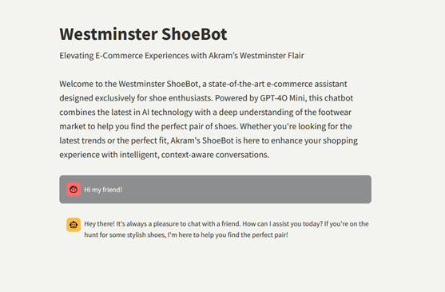

# AN-INTERACTIVE-CHATBOT-SOLUTION-FOR-E-COMMERCE-USING-GENERATIVE-AI-AND-AWS

Project Overview

This project focuses on developing an AI-powered chatbot tailored for the e-commerce industry, specifically targeting customer service for footwear-related data. The chatbot leverages Generative AI and AWS for scalability, using a fine-tuned GPT-4o Mini model and a Retrieval-Augmented Generation (RAG) pipeline for accurate, real-time responses. The goal is to enhance customer engagement, provide personalized product recommendations, and streamline customer service operations.

Introduction

The exponential growth of e-commerce has driven the need for innovative customer service solutions. Traditional methods often fail to keep pace with the increasing demand, leading to delays and dissatisfaction. This project presents an AI-driven chatbot capable of answering queries, providing product recommendations, and tracking order statuses, all in real time. The solution integrates cutting-edge technologies such as Generative AI, Large Language Models (LLMs), and RAG to deliver a highly personalized and efficient customer experience.
Features

    Personalized Responses: Uses GPT-4o Mini fine-tuned on customer service FAQ data for accurate and context-aware responses.
    Real-Time Data Retrieval: Integrates a Retrieval-Augmented Generation (RAG) pipeline to fetch the latest product data from external sources.
    Scalability and Reliability: Deployed on AWS for high availability and scalability.
    Interactive Interface: Streamlit-based user interface for seamless interactions with the chatbot.
    Support for Multilingual Queries: Capable of handling queries in multiple languages, enhancing accessibility.

Technologies Used

    Generative AI: Fine-tuned GPT-4o Mini for generating contextually relevant responses.
    Retrieval-Augmented Generation (RAG): Combines generative capabilities with real-time data retrieval for enhanced response accuracy.
    AWS: For scalable deployment and data storage.
    Streamlit: For creating an interactive web interface.
    LangChain: Integrates LLMs with external data sources for dynamic information retrieval.
    OpenAI Embeddings: Used to process and represent text data as numerical vectors.

Architecture

The architecture involves several key components:

    Data Collection: Customer service FAQs and product data are collected from Hugging Face and Amazon (via Kaggle).
    Embedding Creation: Text data is transformed into vectors using OpenAI embeddings for efficient retrieval.
    Model Fine-Tuning: The GPT-4o Mini model is fine-tuned on the FAQ data to enhance performance.
    RAG Pipeline: Combines the fine-tuned model with real-time data retrieval to provide personalized recommendations.
    Interface Development: A user-friendly interface is built using Streamlit for seamless interactions.

Usage

    Run the chatbot: Every thing is included in the code file.

    Interact with the chatbot through the Streamlit interface by typing queries related to customer service or product recommendations.

Screenshot

 Chatbot Interface: 

Contributing

Contributions are welcome! Please fork the repository and submit a pull request for any suggestions or improvements.
